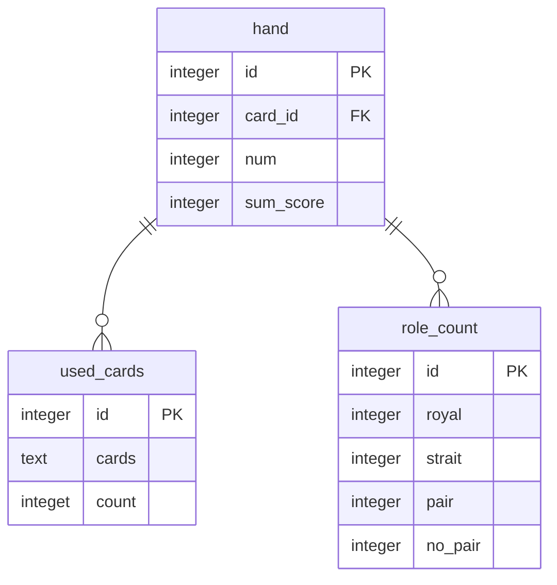

```mermaid
erDiagram

hand ||--o{ used_cards : ""
hand ||--o{ role_count : ""


hand {
    integer id PK
    integer card_id FK
    integer num
    integer sum_score
}

used_cards {
    integer id PK
    text cards
    integet count
}

role_count {
    integer id PK
    integer royal
    integer strait
    integer pair
    integer no_pair
}


```